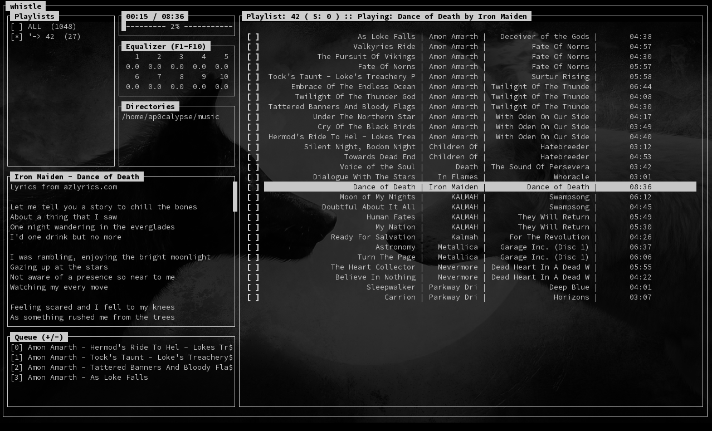

About:
------

whistle aims to be a very minimalistic and basic audio player.
Currently it can play mp3, flac and ogg files.

Basically, whistle is a nifty front-end to mplayer, which it's
based on. Without mplayer, there would be no whistle. The earlier
mpg123 back-end work is now completely done by mplayer.

Latest screenshot:
------------------

Prerequisites:
--------------

Perl Modules:
    
        - MP3::Info                     (archlinux-package: perl-mp3-info)
        - Curses::UI                    (archlinux-package: perl-curses-ui)
        - File::MimeInfo                (archlinux-package: perl-file-mimeinfo)
        - Ogg::Vorbis::Header::PurePerl (aur-package: perl-ogg-vorbis-header-pureperl)
        - Audio::FLAC::Header           (aur-package: perl-audio-flac-header)
        - LWP::UserAgent

Programs:

        - mplayer (mpg123 earlier)

Installation:
-------------

###ArchLinux:

    packer -S mplayer perl-ogg-vorbis-header-pureperl \
              perl-audio-flac-header perl-mp3-info perl-curses-ui \
              perl-file-mimeinfo whistle-git
    
(you maybe need to replace 'packer' with your custom AUR-helper (yaourt, clyde, ...)

###Debian:

    1. apt-get install git mplayer libncurses-ui-perl \
                       libmp3-info-perl libogg-vorbis-header-pureperl-perl \
                       ibaudio-flac-header-perl libfile-mimeinfo-perl
    2. clone the git repository: (git clone https://github.com/ap0calypse/whistle.git)
    3. run whistle and enjoy :)

###Slackware:

Whistle can be installed following these steps (all listed packages are either needed by whistle or are dependencies of each other) :

    1. install sbopkg (http://www.sbopkg.org/downloads.php,-> 
       # installpkg sbopkg-version-noarch-1_cng.tgz)
    2. run sbopkg and sync with slackbuilds.org (Sync with remote repository)
    3. install the following packages:
        - perl-Audio-FLAC-Header
        - perl-Curses
        - perl-Curses-UI
        - perl-File-Which
        - perl-IPC-Run3
        - perl-IPC-System-Simple
        - perl-MP3-Info
        - perl-Module-Build
        - perl-Ogg-Vorbis-Header-PurePerl
        - perl-Probe-Perl
        - perl-TermReadKey
        - perl-Test-Script
        - perl-ExtUtils-depends
        - perl-ExtUtils-makemaker
        - perl-ExtUtils-pkgconfig
        - perl-file-basedir
        - perl-file-desktopentry
        - perl-file-mimeinfo
        - whistle
    4. run whistle and enjoy :)

What works? a.k.a. Features:
----------------------------

        - full MP3/OGG/FLAC play/stop/next/prev/seek/shuffle support
        - progressbar
        - playlists
        - multi-select for playlist-editing
        - better and finer granulated equalizer (10 band)
        - per-song/album-equalizer (meaning: individual equalizer settings 
          for each title/album/artist)
        - lyrics fetching support
        - queue support (+/-)

What's to come?
---------------

        - a lot of bugfixes for sure
        - shuffle by artist/album
        - equalizer presets
        - color support
        - mp3 tag write support
        - burn playlist 2 iso or cd
        - ...
        - your feature request?

Usage:
------

whistle must be started within a fully functional terminal.

The first step is to add a music directory with 'A'. The standard
usage scenario then is to select what you want to play and press 'P'.

Thanks:
-------
 - my girlfriend for beta-testing and giving me hints for improvements :)
 - all the people testing and helping me to improve whistle :)
   (kmandla, matthew cox, smiszym, ...)
 - all the supportive people of the arch-community :)
 - all developers behind mpg123, mplayer and mpv
 - all developers from Curses and Curses::UI
 - all developers from MP3::Info
 - all developers from Ogg::Vorbis::Header
 - all developers from Audio::FLAC::Header
 - mniip for debian install infos
 

If you want to give me some crypto-credit, please use one of these adresses:

LTC - LcWms1wddhRKWyE7JDSxZcY6gZTGTAttXG
BTC - bc1qkggktuhhdms2ue6c04archpvc6h4pqfeu25y3h
DOGE - DRpqNpcfAidAFmkLzaLoB6gVrRgKzNtiRC
